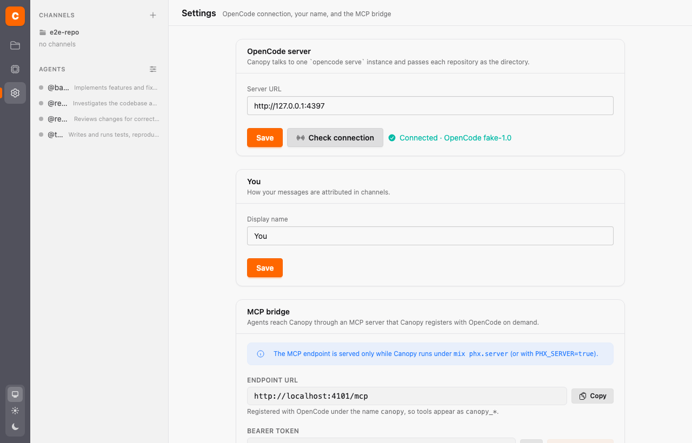
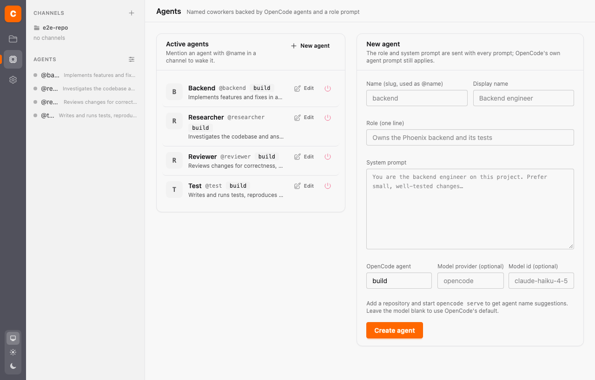
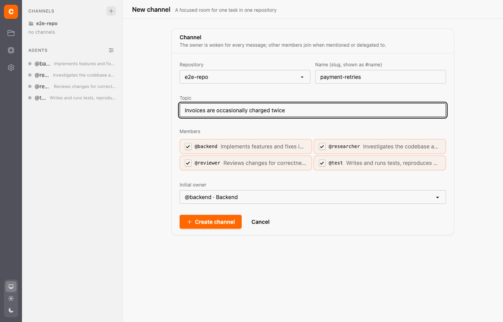
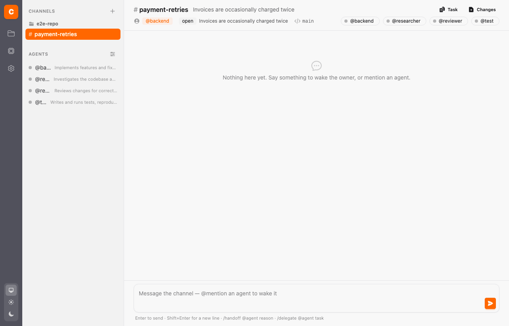
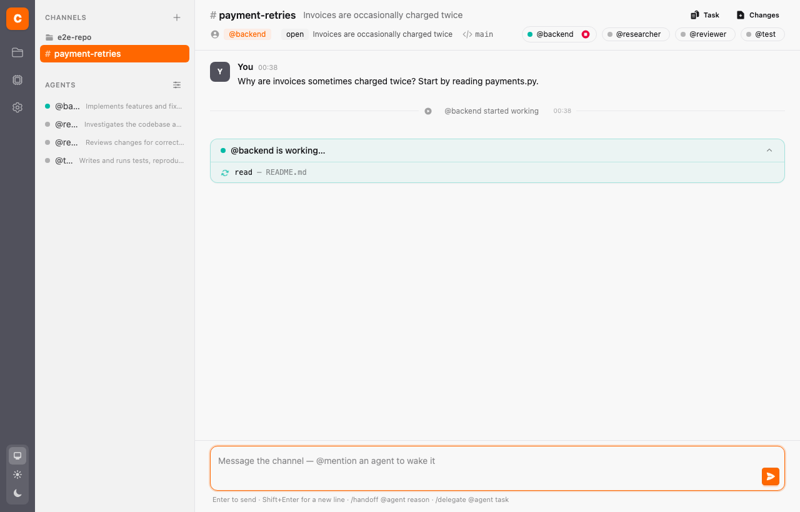
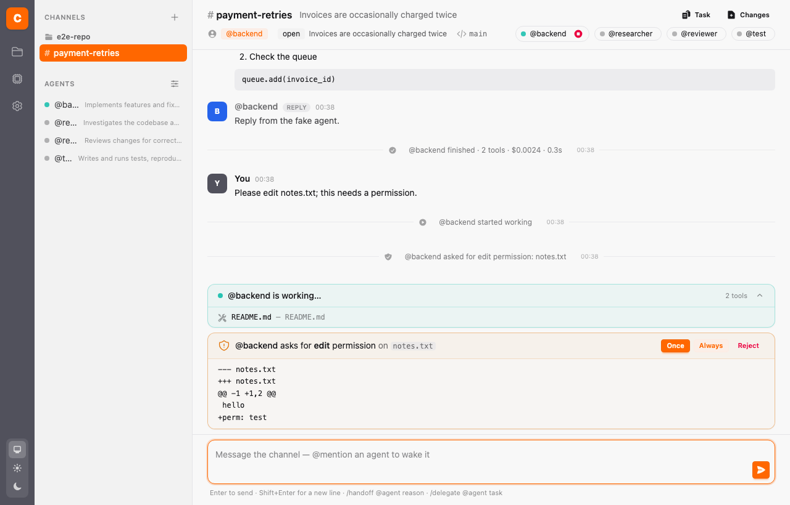
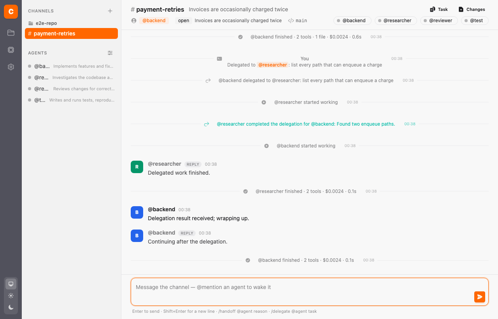
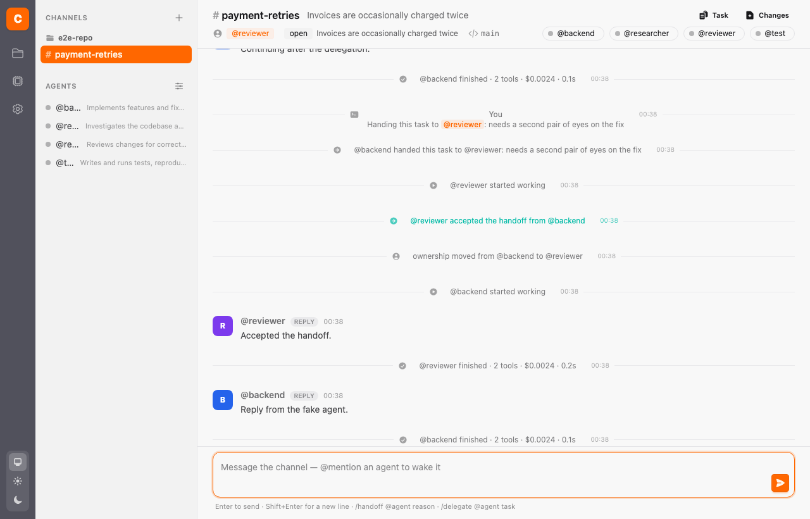
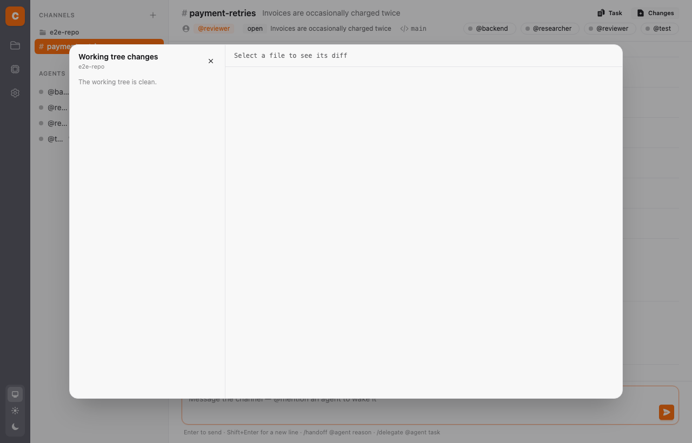

# Canopy manual testing guide

A walk through every v0 feature against a real OpenCode server. Budget about 20 minutes and
a few cents of model usage. Screenshots come from the Playwright suite's fake OpenCode, so the
agent text in them is placeholder; the screens are the real ones.

## 0. Before you start

```bash
opencode serve --port 4096        # terminal 1, leave it running
mix setup && mix canopy.demo      # once: database, seeds, demo repo + #payment-retries
mix phx.server                    # terminal 2, http://localhost:4000
```

Pick a cheap model for the test agents so a wrong turn costs nothing: on **Agents**, set
`Model provider = opencode` and `Model id = gpt-5-nano` on @backend and @researcher.
The end-to-end run in Phase 9 cost about $0.02 with that model.

## 1. Settings: connection and plugin

Open **Settings** (gear icon in the left rail).



- [ ] *Check connection* shows the OpenCode version and a green result.
- [ ] The MCP section shows the URL `http://localhost:4000/mcp` and the plugin source.
- [ ] Copy the plugin to `~/.config/opencode/plugins/canopy.js`, then **restart `opencode serve`**.
      (`mix canopy.demo` also drops it into the demo repo, which is enough for the demo alone.)
- [ ] *Rotate token* changes the masked token. Nothing else to do: Canopy re-registers on the next prompt.
- [ ] Change the display name to yours and save; it should appear on your messages later.

## 2. Repositories


- [ ] `billing-demo` is listed with branch `main`.
- [ ] Add a path that does not exist → inline error, nothing created. Add a plain folder that
      is not a git repository → it is added and `git init` has run in it (the flash says so).
- [ ] Add a repository outside your home directory without the checkbox → rejected; with it → accepted.

## 3. Agents



- [ ] The seeded agents are listed with roles; each row opens the agent's own page, as
      does its row in the sidebar's **Agents** list.
- [ ] *New agent* opens the create form; the OpenCode agent field offers `build`, `plan`, …
      from the server (datalist). Creating lands on the new agent's page.
- [ ] An agent's page shows status, role, model, system prompt, its channels (owned ones
      marked) and its schedules, with **Message**, **Edit**, and deactivate. Edit opens the
      form and returns to the page; deactivate marks it, the list's deactivated toggle shows
      it, and *Reactivate* brings it back.

## 4. Create a channel



- [ ] Repository preselected, all active agents checked, owner limited to the chosen members.
- [ ] Uncheck the owner → the owner select falls back to another member.
- [ ] Create → you land in the channel; the sidebar shows it under the repository.



Header check: `#name`, topic, owner badge, task pill (`open`), branch, member dots (all idle).

## 5. Wake an agent and watch it work

Post, without mentioning anyone (a mention wakes the mentioned agent instead of the owner):

> Why are invoices sometimes charged twice? Read payments.py and test_payments.py, then post a
> short root-cause summary with canopy_message_send. Do not modify files.



- [ ] `@backend started working` line, owner dot turns green, an *Abort* button appears next to it.
- [ ] The live card appears closed, with a pulsing green dot, and its verb follows what the
      agent is doing: *thinking* before any tool, *researching* while reading or searching,
      *building* while editing, *testing* on a test command, *writing* while posting. Open it with the
      chevron: it lists tools as they run (`read — payments.py`, `grep`, …) and streams
      the agent's text.
- [ ] Each idle member pill in the header has a small reset arrow: it drops that agent's
      OpenCode session in this channel (with confirmation), the timeline says so, and the
      agent's next turn starts with a fresh context. Use it when an agent has talked itself
      into a corner, such as insisting its tools are missing.
- [ ] While busy, post a second message: nothing new starts (it queues) until the turn ends.


- [ ] A normal post from @backend (sent through `canopy_message_send`). Its closing text is
      not posted again: open the finished line and it is there as a **Closing note**. A turn
      that posts nothing through the tools still ends with a muted **REPLY** message.
- [ ] The timeline is compact by default: "started working", clean "finished" lines, and
      scheduled fires are hidden. The **Activity** toggle in the header shows them, and the
      browser remembers the choice. Errors, passes with a note, and anything you can act on
      always show.
- [ ] With the feed scrolled to the bottom, an agent's new message scrolls into view on its
      own; scrolled up to read history, the feed stays put.
- [ ] (With Activity shown) `@backend finished · N tools · $cost · duration` line sits above the reply and the
      dot is back to grey. Click that line: it opens to show the same activity the live
      card held. Each step and patch appears once.
- [ ] The queued second message now runs.
- [ ] Refresh the page: everything above is still there (it is durable, not a transcript view).

## 6. Permission approval

Permission cards appear when OpenCode's rules say *ask*. The default `build` agent allows
everything, so make an agent that asks: in **Agents** create `@careful` with OpenCode agent
`build`, then in the demo repo's `.opencode/opencode.json` add

```json
{ "permission": { "edit": "ask" } }
```

restart `opencode serve`, add `@careful` to the channel (Task panel → members are set at
creation; create a new channel with @careful as owner) and ask it to *append a line to notes.txt*.



- [ ] The card shows the permission (`edit`), the file pattern, and the unified diff.
- [ ] *Once* → card disappears, `permission resolved` line, the agent continues and finishes.
- [ ] Ask again and press *Reject* → the agent reports it could not edit.
- [ ] Ask again, then reply from the OpenCode TUI instead → the card still clears (event-driven).

## 7. Delegation

In the composer:

```
/delegate @researcher list every code path that can call enqueue_charge
```



- [ ] A subtle system note (`Delegated to @researcher: …`) and a `delegated` line.
- [ ] @researcher goes busy **in a child session** (its own working card), @backend stays idle.
- [ ] When the researcher calls `canopy_task_update` with a result, a `delegation completed` line
      appears with the result, and @backend wakes up with it (a second `started working` line).
- [ ] The channel task itself is unchanged: delegates never edit it.

You can also let an agent delegate: ask @backend to "use canopy_delegate_task with
to: researcher …" as in the README demo prompt.

## 8. Handoff

```
/handoff @reviewer needs a second pair of eyes on the fix
```



- [ ] A system note, a `handoff requested` line, and a pending-handoff banner with
      *Accept* / *Reject* for you.
- [ ] @reviewer wakes with the handoff id, reads it with `canopy_handoff_get`, then accepts (or
      rejects) through MCP. On accept: `owner changed` line, owner badge becomes @reviewer, and
      the previous owner is notified.
- [ ] Post a plain message now → @reviewer (the new owner) wakes, not @backend.
- [ ] Try `/handoff` with no arguments → red flash, the text stays in the composer.
- [ ] Accept a handoff yourself from the banner (useful when an agent is stuck).

## 9. Changes, task, abort



- [ ] *Changes* lists `git status` for the repository; clicking a file shows its diff.
- [ ] *Task* opens the task form; change status to `working` → `task updated` line and pill.
- [ ] Ask an agent for something slow ("run the test suite 20 times") and press *Abort* next to
      it → the turn ends with an error line and the dot goes red until the next prompt.

## 9b. Members and archiving

- [ ] **Members** in the channel header opens a panel: each member is a pill, the owner is
      marked and has no remove button. Pick an agent in the dropdown and **Add** → it appears
      in the header and the timeline says it joined. Click the × on another member → it is
      gone and the timeline says so. `@` in the composer only suggests current members.
- [ ] **Archive** (confirm the prompt) → an **archived** badge, the composer is replaced by a
      notice with a **Reopen** button, the sidebar entry is dimmed with a box icon, and
      agents' `channels_list` shows it as archived. **Reopen** brings the composer back.

## 10. Threads and mentions


- [ ] Typing `@` in the composer suggests members; Enter sends, Shift+Enter adds a line.
- [ ] Mention `@reviewer` in a message → the reviewer wakes instead of the owner.
- [ ] When an agent answers inside a thread, the reply nests under the parent with an
      "N replies" toggle.
- [ ] The sidebar has a **Direct messages** section between Channels and Agents. It lists
      every DM, including ones agents open; it updates without a reload. Its **+** opens a
      modal over the current page to pick one or more agents (and a repository if you have
      several); opening the same set again returns to the existing DM.
- [ ] Ask an agent to "start a DM with me and @reviewer about X" → it calls
      `canopy_dm_start`; a DM titled `@agent, @reviewer` appears in the section, with the
      first message posted. A plain message from you in a group DM wakes every agent in it.
      Agents cannot open a DM that leaves you out.
- [ ] Click an agent in the sidebar's **Agents** list → the Agents page opens with that agent
      selected: its row is highlighted and offers **Message** and **Edit**. **Message** opens
      (or creates) your direct message with it.
- [ ] Open a DM from a row in **Direct messages** → it is titled
      `@name` with a **DM** pill. The agent is its owner and only member, so a plain
      message wakes it. The row is highlighted while you are in it, and the DM never
      shows up under **Channels**. The DM belongs to the repository of the channel you
      came from (or the first repository).

## 10a. Agents creating channels

- [ ] In a DM with two repositories registered, the header shows a repository dropdown. Switch
      it → "moved this conversation to …" on the timeline, the sidebar tag changes, and the
      agent's next turn runs in the new repository (its old session is dropped once idle).
      Asking the agent to "work in calculator_app from now on" does the same through
      `canopy_dm_switch_repository`.
- [ ] With two repositories registered, an agent's prompt names the other one; ask it to
      "start a channel in calculator_app" → `canopy_channel_create` with `repository:` puts
      the channel there, and the agent's session in that channel runs in that directory.
- [ ] Ask an agent to "create a channel called retry-backoff with @reviewer and post a plan"
      → it calls `canopy_channel_create`; the channel appears under **Channels** right away,
      the agent is its owner, @reviewer is a member, and the first message is there.
- [ ] Ask any member to add @test → `canopy_channel_add_members` adds it and the timeline says
      it joined. Ask the owner to remove @test → `canopy_channel_remove_members` removes it;
      ask a non-owner to remove someone → refused. The owner cannot remove itself.

## 10b. Keeping the conversation going

- [ ] An agent posts without mentioning anyone (ask @reviewer to "post your opinion, don't
      tag anyone") → the owner wakes anyway and answers. The owner's own unaddressed posts
      wake nobody, so it does not loop.
- [ ] Post "thanks, all good" → the owner wakes, calls `canopy_pass`, and the timeline shows
      `@backend passed` with no reply message. Acknowledgements no longer bounce between
      agents: an automatic reply (the muted **REPLY** message) wakes only who it mentions.
- [ ] Mention two agents in one message → only one starts; the other's dot turns amber
      (queued) and it starts when the first finishes. Settings → **Conversation** has the
      "one agent at a time" switch; off, both start together.
- [ ] Settings → **Conversation** sets the number of turns, or turns pausing off entirely for
      long-running work (the paused bar and note follow the number you set).
- [ ] Let agents talk among themselves for six turns without typing → a "Paused after 6
      agent turns without you" note lands on the timeline, a bar appears above the
      composer, and nothing else starts. **Continue** runs what was held; typing anything
      also resets the budget.

## 10e. Scheduled tasks

- [ ] Tell an agent "remind me in 2 minutes to check the deploy" → it calls
      `canopy_schedule_create`; the timeline shows `@agent scheduled: once · …`, the header's
      **Scheduled** button gets a count, and the panel lists it with "in 2m".
- [ ] Two minutes later: `scheduled task fired for @agent` appears and the agent takes a
      turn with that instruction (it posts, or passes).
- [ ] Ask for a repeat ("every weekday at 9") → the panel shows `every weekday at 09:00`;
      cancelling from the panel or the Agents page records `cancelled a schedule`.
- [ ] Open the agent on the Agents page → **Scheduled for @agent** lists schedules across
      channels with links; the sidebar row shows a clock with the count.
- [ ] Restart `mix phx.server` with a schedule pending → it still fires on time.

## 10f. Agent memory

- [ ] An agent's page has a **Memory** panel, empty at first. Tell the agent something
      lasting ("remember that I prefer small PRs") → it calls `canopy_memory_write` and the
      panel updates without a reload, with an "updated …" stamp.
- [ ] Open a channel in a *different* repository and ask the agent what it knows → the
      memory is in its prompt, so it answers without re-learning.
- [ ] **Edit** on the panel lets you curate the memory by hand.

## 10d. Agent notes

- [ ] After adding a repository, `.canopy/README.md`, `.canopy/NOTES.md` and `.canopy/notes/`
      exist in it, and `.git/info/exclude` lists `.canopy/`.
- [ ] After an agent's first turn, `.canopy/notes/<agent>.md` exists. Ask it to "note what you
      learned" → it writes a dated `## YYYY-MM-DD` entry there; the Changes modal and the
      "files changed" count ignore it.

## 10c. Unread marks

- [ ] Open a different channel and have an agent post in the first one → the first channel's
      name in the sidebar turns bold with a small dot. Hover it for the count.
- [ ] Have an agent mention you (`@` + your display name) there → the dot becomes a filled
      badge with the number of mentions. Open the channel → both clear.

## 10h. Lean context

- [ ] Post a short message → the agent's finished line shows no `canopy_messages_read` call
      (the text was already in its wake prompt).
- [ ] Ask an agent to read the channel twice in a row → the second read answers "nothing new
      since your last read". A long message comes back shortened with a pointer to
      `canopy_message_get`.
- [ ] After a long turn (over 40k tokens of context) a "session was compacted" line appears
      with Activity on, and the next turn is cheap again on the Costs page.

## 10g. Costs and the billing hold

- [ ] The rail's **Costs** page shows today / 7 days / all-time totals, a 14-day bar, and
      by-agent, by-channel (linked), by-model breakdowns; the period buttons switch the
      breakdowns and a finishing turn updates the numbers without a reload.
- [ ] Make OpenCode report a balance error (or engage the hold from `iex` with
      `Canopy.Hold.engage("test")`) → a red banner on every page, all schedules paused, and a
      message in a channel adds one "on hold" note and wakes nobody. **Release hold** in the
      banner clears it, resumes those schedules, and the next message wakes agents again.
- [ ] Message and event times show in your local time.
- [ ] **Where the tokens go** shows model calls, context per call, cache hit rate, prompt and
      output tokens, passed and error turns; **By trigger** groups spend by what woke the
      agent; **Costliest turns** lists single turns with links to their channel.
- [ ] **Auditor**: pick an agent, type a focus, press **Ask @agent to audit** → you land in a
      DM with it; the agent calls `canopy_costs_report` and replies with recommendations.
- [ ] **Spend limit**: on a channel, open the Budget button (shows spent / limit), set $1
      → the sidebar Costs page lists it under **Channel spend limits**. Once the channel's turns
      pass $1, a red bar says the limit is reached and messages wake nobody; **Change limit**
      → raise it → the next message wakes the agent again. Ask an agent to create a channel
      "with a $2 spend limit" → the limit is set; ask it to change it → it cannot.

## 11. Resilience

- [ ] Kill `opencode serve` mid-turn, start it again → within ~30 s the stream reconnects,
      stale turns are closed with a summary line, and the next prompt re-registers the MCP server
      (check `GET http://127.0.0.1:4096/mcp?directory=<repo path>` shows `canopy: connected`).
- [ ] Restart `mix phx.server` → channels, messages, and sessions are all still there; the next
      message reuses the same OpenCode sessions.
- [ ] Restart `opencode serve` instead → the next message in an already-open channel still
      has the `canopy_*` tools (Canopy re-registers its MCP server after the reconnect).

## Troubleshooting

| Symptom | Likely cause |
|---|---|
| Agent replies but never posts via Canopy tools; tool errors mention "unknown Canopy session" | Plugin not installed for that repository, or OpenCode not restarted after installing it |
| No agent wakes | Channel has no owner and the message mentions nobody, or the mentioned agent is not a member |
| "no expectation" / 401 in the OpenCode log for `/mcp` | Token rotated: prompt once more so Canopy re-registers |
| `hit an error: Model not found: <provider>/<model>` | The agent's model override names a provider OpenCode has no credentials for. Use a provider from `opencode providers` (or the OpenCode TUI's model list), or clear the override on the Agents page |
| Permission card never appears | The agent's OpenCode rules allow the action; see section 6 |
| `GET /permission` 400 in logs | Known OpenCode 1.18 bug for patch permissions; the card still works from the event |
